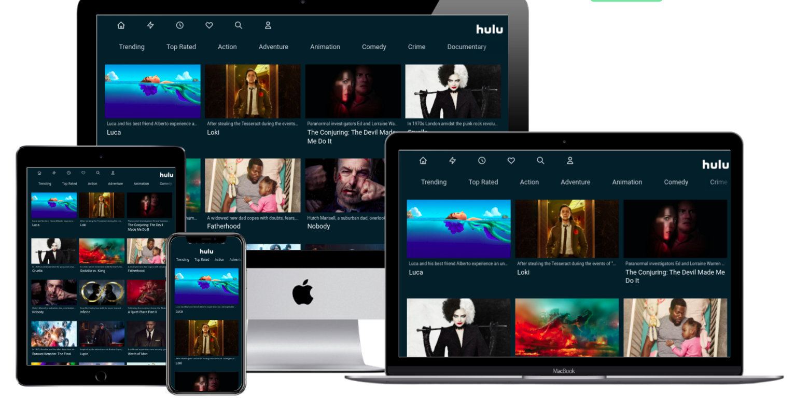
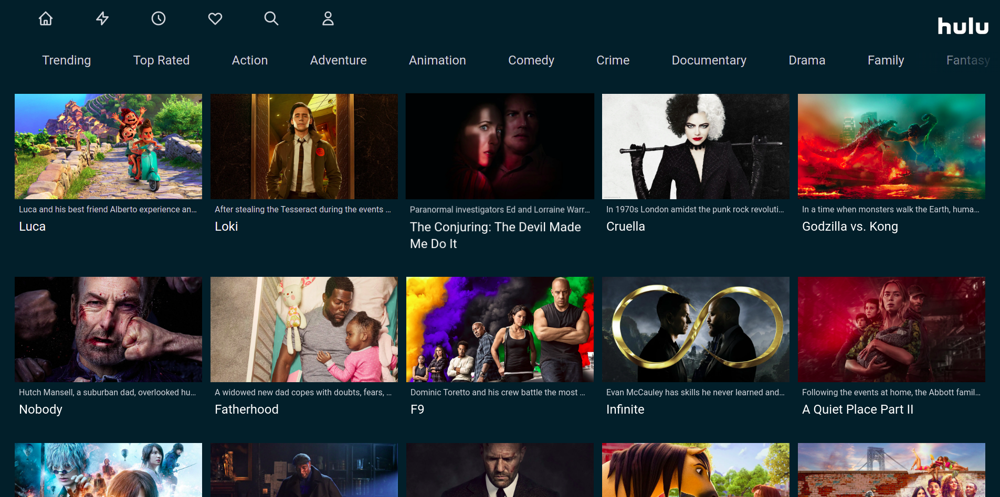
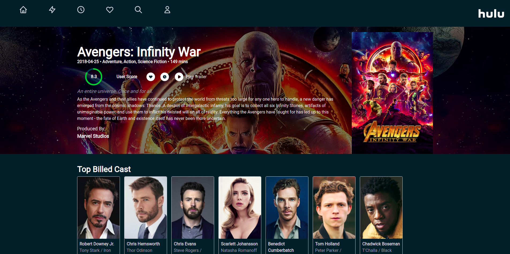
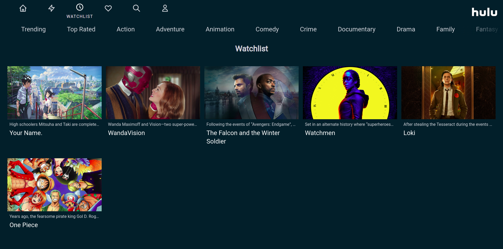

# Hulu Clone

Hulu Clone made using [Next.js](https://nextjs.org/) and [Tailwind CSS](https://tailwindcss.com/).
The build allows **Server Side Rendering** and is fully responsive. The data is fetched dynamically from [TMDB](https://www.themoviedb.org/) API.

The backend is deployed separately. It uses **Express Node** and **MongoDB** with **JWT Authentication**. Check out the backend project [here](https://github.com/tarunluthra123/Movie-Backend).

This project can be viewed live here - [Click Here](https://hulu-clone-amber.vercel.app/)









### To run locally

1. Clone the project into your local repository and install the packages

```sh
yarn
# or
npm install
```

2. Create a local .env file in the root directory of the project and store your API_KEY for [TMDB](https://developers.themoviedb.org/3) inside it.
   Also create other required environment variables inside it. Refer to .env.sample for reference.

```sh
# .env
API_KEY=abcd123
```

3. Run the Next.js local development server

```sh
yarn dev
# or
npm run dev
```
